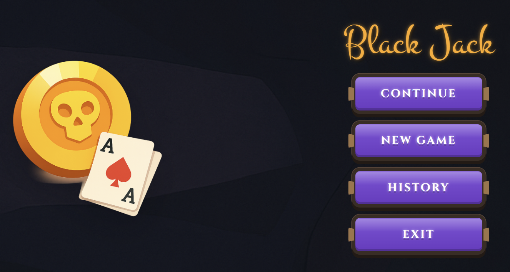
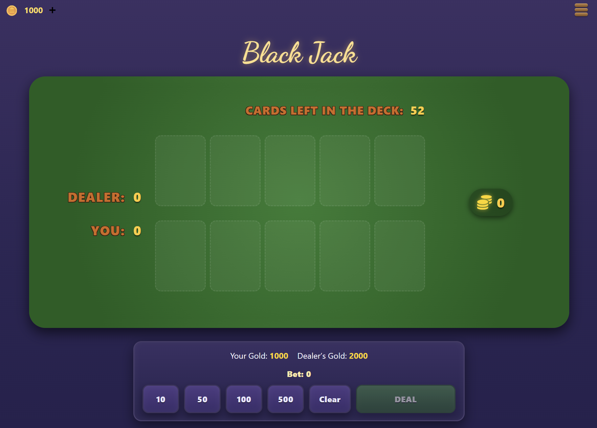
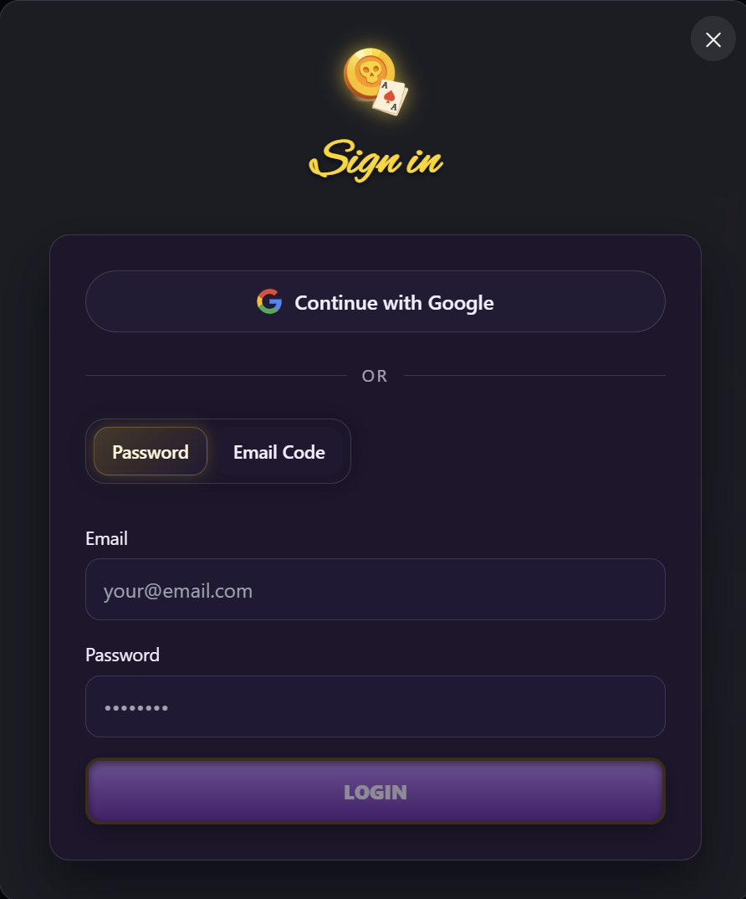
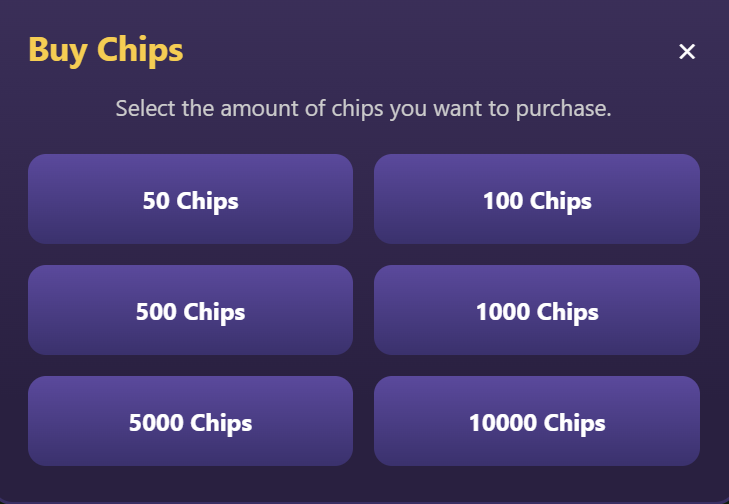
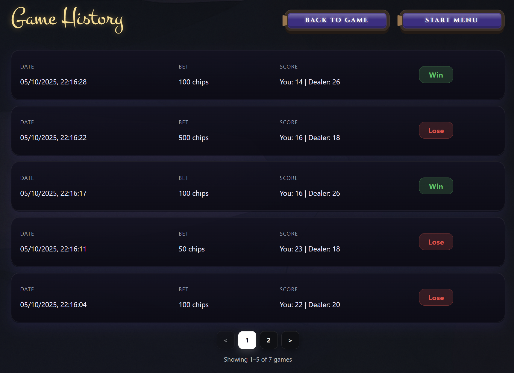

# Black Jack Client

A **Vite-driven React** experience that guides players from onboarding to gameplay, history, and authentication with immersive visuals and **AI-powered assistance**.

**homepage**


**startpage**


**gamepage**


**login-window**


**buy-window**


**historypage**


## ⚙️ Setup

### 1. Install Dependencies

```bash
npm install
```

### 2. Configure client/.env

```bash
VITE_API_BASE=http://localhost:5174
VITE_GOOGLE_CLIENT_ID=<your-google-client-id>
```

-   `VITE_API_BASE` injects the API origin into every fetch helper call.

-   `VITE_GOOGLE_CLIENT_ID` enables Google One Tap inside the login flow.

## Scripts

| Command           | Description                                            |
| ----------------- | ------------------------------------------------------ |
| `npm run dev`     | Start Vite with hot reloading and API proxying.        |
| `npm run build`   | Type-check with `tsc -b` and emit a production bundle. |
| `npm run lint`    | Enforce project lint rules.                            |
| `npm run preview` | Serve the production build locally.                    |

## ✨ Feature Highlights

-   **Routing shell** – React Router provides dedicated routes for home, start, play, login, signup, and history flows.
-   **Brand-forward hero** – A spinning Three.js gold coin anchors the home screen, complementing CTA modals for login, signup, and guest entry.
-   **Guest session scaffolding** – Home and Start pages initialize guest bankrolls, purge local history when appropriate, and transition into play or authenticated flows cleanly.
-   **Table experience** – Game state is synchronized with the API, with bankroll previews, chip betting, action controls, and menu overlays orchestrated across `GamePage`, `GamePanel`, `BottomBar`, `HeaderBar`, and `SideMenu`.
-   **AI guidance** – In-round AI prompts leverage the `/api/games/:id/ai` endpoint and visually flag recommended actions in the bottom bar.
-   **Authentication surfaces** – Login and signup support password, email code, and Google OAuth flows with modal-friendly UX patterns, cooldown timers, and clipboard-aware inputs.
-   **History timeline** – Authenticated users fetch paginated history with retry/abort handling, while guests fall back to local storage data sorted newest-first.
-   **Offline resilience** – Completed guest rounds persist locally, and session metadata is saved between reloads for both guest and authenticated users.


## API Access

All network calls go through `apiFetch`, which injects bearer tokens automatically and centralizes the configured base URL.
